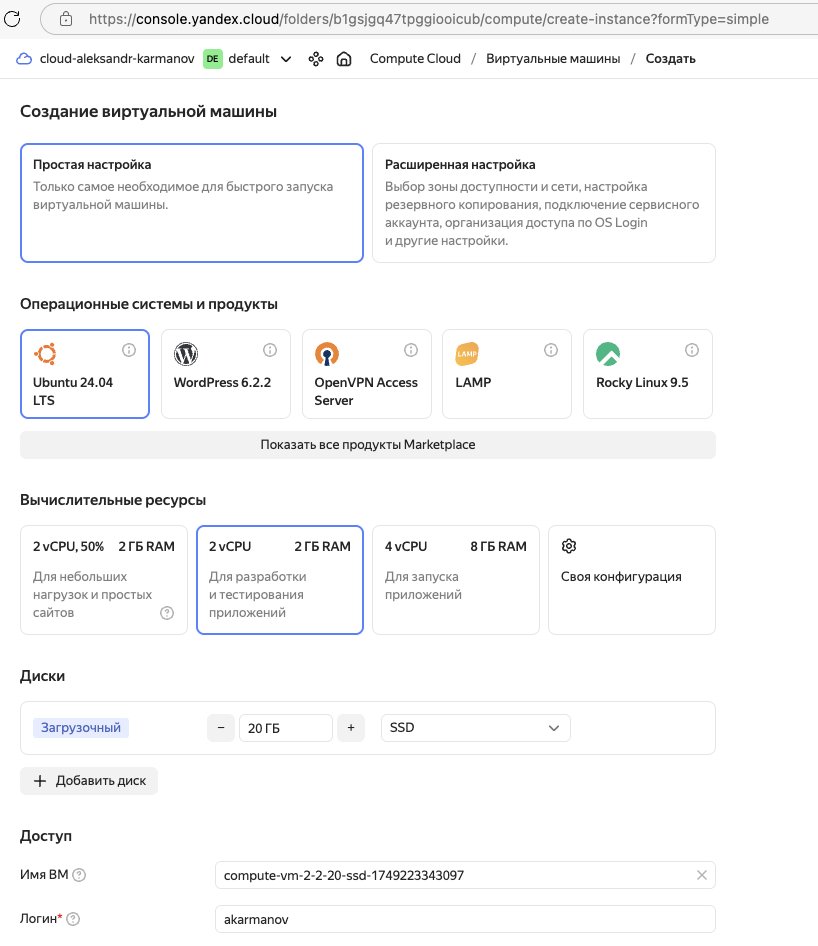
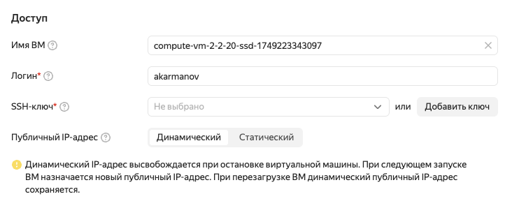
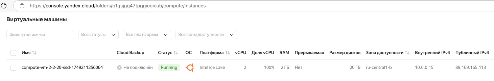
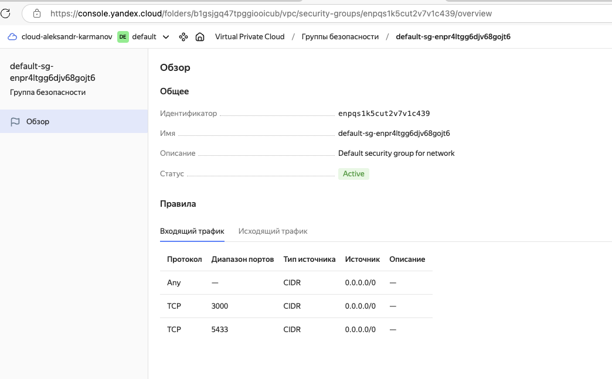
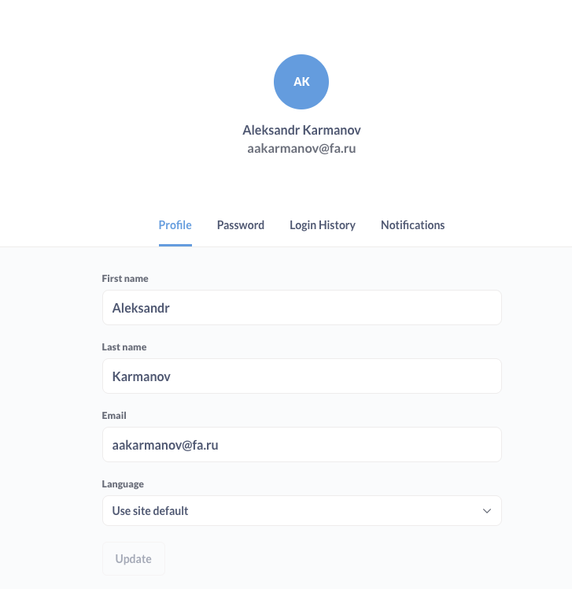
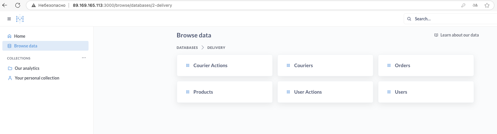

# BI System: Metabase + PostgreSQL + Docker

🚀 Полностью автоматизированная BI-система на базе [Metabase](https://www.metabase.com/) и PostgreSQL, разворачиваемая одной командой через Docker Compose.  
Подходит для локальной разработки, тестирования и быстрого деплоя в облако (Yandex Cloud, AWS, DigitalOcean и др.).

---

## 📦 Состав проекта

- **PostgreSQL 16** — хранилище данных и аналитических витрин
- **Metabase** — визуализация данных, дашборды, отчёты
- **Docker Compose** — быстрое и автоматическое развёртывание всего стека
- **initdb/** — автоматическая инициализация БД (SQL, CSV, создание схем и пользователей)

---

## 🚀 Быстрый старт

1. **Клонируй репозиторий**

    ```bash
    git clone https://github.com/3yungar/bi_system_design.git
    cd bi-system-design
    ```

2. **Запусти всю систему**

    ```bash
    docker-compose up -d
    ```

3. **Открой Metabase**

    - Локально: [http://localhost:3000](http://localhost:3000)
    - В облаке: [http://<ваш-внешний-IP>:3000](http://<ваш-внешний-IP>:3000)

4. **Создай первого пользователя (админа)** и настрой подключение к базе.

---

## 🗄️ Структура папок
```
bi-system-design/
├── docker-compose.yml
├── pgdata/ # Данные PostgreSQL (volume, не коммитится в git)
├── initdb/ # Скрипты и CSV для автоматической инициализации
│ ├── 01_create_db.sql
│ ├── 02_create_tables.sql
│ ├── 03_import_data.sql
│ ├── couriers.csv
│ └── ...
├── .gitignore
└── README.md
```

---

## ⚙️ Переменные и порты

- **Metabase:** порт `3000`
- **Postgres:** порт `5433` на хосте (мэппится в `5432` внутри контейнера)
- Все данные хранятся в volume `pgdata` (безопасно для перезапуска контейнеров)

---

## 🛠️ Как изменить данные

- **Измени CSV-файлы и SQL-скрипты в `initdb/`**
- Пересоздай volume базы, чтобы скрипты отработали заново:

    ```bash
    docker-compose down -v
    docker-compose up -d
    ```

---

## 🛡️ Безопасность и best practices

- Все пароли и переменные вынесены в `docker-compose.yml` (можно сделать `.env` для продакшена)
- Пароли по умолчанию поменяй перед публикацией репозитория!
- Не коммить папку `pgdata` (она исключена через `.gitignore`)
- Для HTTPS используй nginx/traefik как внешний proxy

---

## 📤 Быстрый деплой в облако (Yandex Cloud, AWS, DigitalOcean)

### 1. Арендуй сервер в Yandex Cloud

- Перейди на [cloud.yandex.ru](https://cloud.yandex.ru/services/compute)
- Создай ВМ с параметрами:
    - **ОС:** Ubuntu 22.04/24.04 LTS
    - **vCPU:** 2 (минимум), **RAM:** 2–4 GB
    - **Диск:** 20+ GB SSD
    - **Публичный IP:** включён

    

- Сгенерируй SSH-ключ (Mac/Linux/Windows PowerShell):
    ```bash
    ssh-keygen -t ed25519 -C "yacloud"
    ```
    Скопируй содержимое файла `~/.ssh/id_ed25519.pub` и вставь при создании ВМ.
    

- Дождись выдачи внешнего IP (он появится в панели управления Яндекс.Облака).
    

### 2. Подключись к серверу по SSH

**Linux/Mac/PowerShell:**

```bash
ssh akarmanov@<Внешний_IP_ВМ>
```

### 3. Установи Docker и Docker Compose

```bash
sudo apt update && sudo apt install -y docker.io docker-compose
sudo usermod -aG docker $USER
exit  # выйди и заново подключись по SSH, чтобы применились права
ssh akarmanov@<Внешний_IP_ВМ>
```

### 4. Клонируй репозиторий и запусти BI-систему

```bash
git clone https://github.com/3yungar/bi_system_design.git
cd bi_system_design
docker-compose up -d
```

### 5. Открой порт 3000 для доступа к Metabase

- В панели Yandex Cloud перейди в “Группы безопасности”/“Сетевые настройки” ВМ
- Добавь правило для входящего трафика:

    - Протокол: TCP
    - Порт: 3000
    - Источник: 0.0.0.0/0 (или только твой IP)

    


### 6. Открой Metabase в браузере

- Перейди на http://<Внешний_IP_ВМ>:3000
- Создай админ-аккаунт и работай!



---


## 📚 Полезные ссылки

- [Metabase Documentation](https://www.metabase.com/docs/latest/)
- [PostgreSQL Documentation](https://www.postgresql.org/docs/)
- [Docker Compose Documentation](https://docs.docker.com/compose/)

---


## 🏷️ License

MIT License
